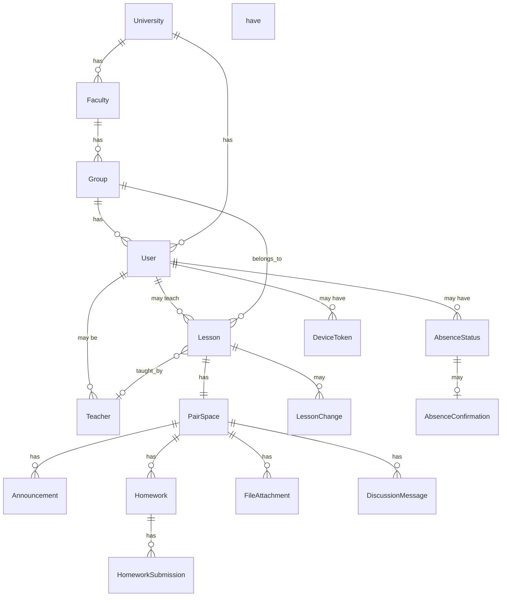

# Модель данных

## Обзор сущностей

Все доменные сущности (кроме справочников) имеют `university_id` для мультивузовости.  
Полная SQL-схема: [database/schema-full.sql](../database/schema-full.sql).

## Ключевые сущности

| Сущность | Описание | Ключевые поля | Типы |
|----------|----------|---------------|------|
| **User** | Пользователь системы | id, phone, email, roles[], university_id, group_id | UUID, VARCHAR, VARCHAR, comma-separated string (simple-array), UUID, UUID |
| **University** | Учебное заведение | id, name, city, connector_config, status | UUID, VARCHAR, VARCHAR, JSONB, VARCHAR |
| **Faculty** | Факультет | id, university_id, name, code, dean_user_id | UUID, UUID, VARCHAR, VARCHAR, UUID |
| **Group** | Учебная группа | id, faculty_id, name, curriculum_year, specialization | UUID, UUID, VARCHAR, INTEGER, VARCHAR |
| **Teacher** | Привязка преподавателя | id, user_id, university_id, department | UUID, UUID, UUID, VARCHAR |
| **Lesson** | Пара (ключевая сущность) | id, university_id, group_id, teacher_id, subject, room, day_of_week, start_time, end_time, week_type, start_date, end_date | UUID, UUID, UUID, UUID, VARCHAR, VARCHAR, INTEGER, TIME, TIME, VARCHAR, DATE, DATE |
| **LessonChange** | Изменение пары | id, lesson_id, change_type, old_values, new_values | UUID, UUID, VARCHAR, JSONB, JSONB |
| **PairSpace** | Пространство пары | id, lesson_id, active_until | UUID, UUID, TIMESTAMP |
| **Announcement** | Объявление | id, pair_space_id, author_id, text, is_pinned | UUID, UUID, UUID, TEXT, BOOLEAN |
| **Homework** | Домашнее задание | id, pair_space_id, title, description, deadline | UUID, UUID, VARCHAR, TEXT, TIMESTAMP |
| **HomeworkSubmission** | Статус сдачи ДЗ | id, homework_id, student_id, status | UUID, UUID, UUID, VARCHAR |
| **FileAttachment** | Файл | id, pair_space_id, file_url, file_type, size | UUID, UUID, VARCHAR, VARCHAR, INTEGER |
| **DiscussionMessage** | Сообщение обсуждения | id, pair_space_id, user_id, text, parent_id | UUID, UUID, UUID, TEXT, UUID |
| **AbsenceStatus** | Статус отсутствия | id, user_id, type, start_date, end_date, comment | UUID, UUID, VARCHAR, DATE, DATE, TEXT |
| **AbsenceConfirmation** | Подтверждение куратора | id, absence_id, curator_id, status | UUID, UUID, UUID, VARCHAR |
| **Notification** | Уведомление | id, user_id, type, title, body, deep_link, is_read | UUID, UUID, VARCHAR, VARCHAR, TEXT, VARCHAR, BOOLEAN |
| **DeviceToken** | Токен устройства | id, user_id, platform, token | UUID, UUID, VARCHAR, VARCHAR |
| **AuditLog** | Лог действий | id, user_id, action, entity, entity_id, ip | UUID, UUID, VARCHAR, VARCHAR, UUID, VARCHAR |

## Мультивузовость

Каждая сущность, привязанная к вузу, имеет `university_id` (UUID → universities.id).  
Все API-запросы фильтруются по `university_id` текущего пользователя.  
См. [ADR-0002](../decisions/0002-multitenancy-university-id.md).

## Статусы отсутствий

| Статус | Код | Цвет |
|--------|-----|------|
| Учусь | `learning` | зелёный |
| Болен | `sick` | оранжевый/красный |
| Работа / занятость | `work` | синий |
| Другой город | `other_city` | фиолетовый |
| Другая причина | `other` | серый |

## Типы изменений расписания

| Тип | Код | Описание |
|-----|-----|----------|
| Перенос | `moved` | Пара перенесена на другое время/дату |
| Отмена | `cancelled` | Пара отменена |
| Смена аудитории | `room_changed` | Другая аудитория |
| Смена преподавателя | `teacher_changed` | Другой преподаватель |
| Добавление | `added` | Новая пара |

## Seed data

Для пилота на СИБИТ: [database/seed.md](../database/seed.md).
