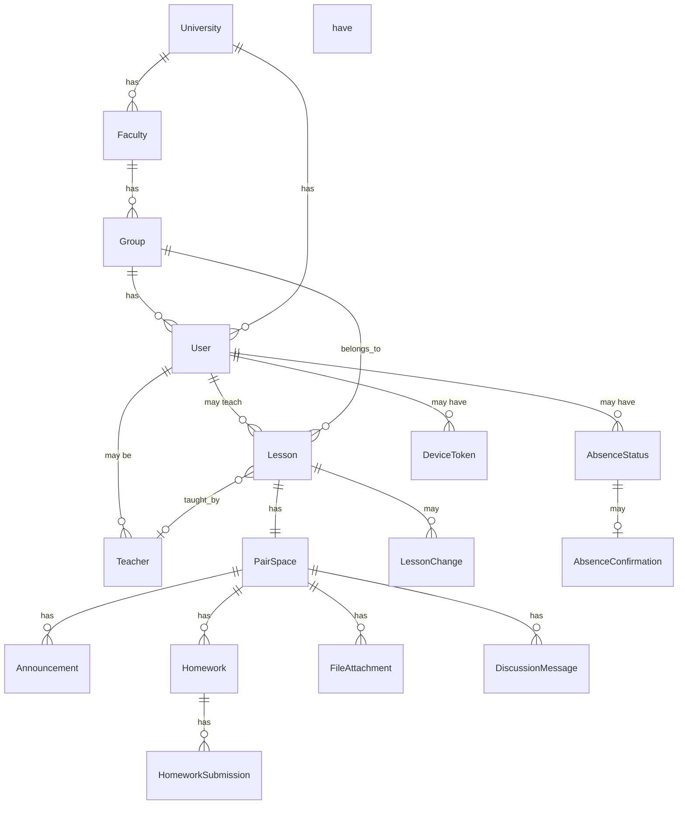

# Модель данных

## Обзор сущностей

Все доменные сущности (кроме справочников) имеют `university_id` для мультивузовости.  
Полная SQL-схема: [database/schema-overview.md](../database/schema-overview.md).

## Ключевые сущности

| Сущность | Описание | Ключевые поля |
|----------|----------|---------------|
| **User** | Пользователь системы | id, phone, email, roles[], university_id, group_id |
| **University** | Учебное заведение | id, name, city, connector_config, status |
| **Faculty** | Факультет | id, university_id, name, code, dean_user_id |
| **Group** | Учебная группа | id, faculty_id, name, curriculum_year, specialization |
| **Teacher** | Привязка преподавателя | id, user_id, university_id, department |
| **Lesson** | Пара (ключевая сущность) | id, university_id, group_id, teacher_id, subject, room, day_of_week, start_time, end_time, week_type, start_date, end_date |
| **LessonChange** | Изменение пары | id, lesson_id, change_type, old_values, new_values |
| **PairSpace** | Пространство пары | id, lesson_id, active_until |
| **Announcement** | Объявление | id, pair_space_id, author_id, text, is_pinned |
| **Homework** | Домашнее задание | id, pair_space_id, title, description, deadline |
| **HomeworkSubmission** | Статус сдачи ДЗ | id, homework_id, student_id, status |
| **FileAttachment** | Файл | id, pair_space_id, file_url, file_type, size |
| **DiscussionMessage** | Сообщение обсуждения | id, pair_space_id, user_id, text, parent_id |
| **AbsenceStatus** | Статус отсутствия | id, user_id, type, start_date, end_date, comment |
| **AbsenceConfirmation** | Подтверждение куратора | id, absence_id, curator_id, status |
| **Notification** | Уведомление | id, user_id, type, title, body, deep_link, is_read |
| **DeviceToken** | Токен устройства | id, user_id, platform, token |
| **AuditLog** | Лог действий | id, user_id, action, entity, entity_id, ip |

## Мультивузовость

Каждая сущность, привязанная к вузу, имеет `university_id` (UUID → universities.id).  
Все API-запросы фильтруются по `university_id` текущего пользователя.  
См. [ADR-0005](../03_DECISIONS/0005-multitenancy-university-id.md).

## Статусы отсутствий

| Статус | Код | Цвет |
|--------|-----|------|
| Учусь | `learning` | зелёный |
| Болен | `sick` | оранжевый/красный |
| Работа / занятость | `work` | синий |
| Другой город | `other_city` | фиолетовый |
| Другая причина | `other` | серый |

## Типы изменений расписания

| Тип | Код | Описание |
|-----|-----|----------|
| Перенос | `moved` | Пара перенесена на другое время/дату |
| Отмена | `cancelled` | Пара отменена |
| Смена аудитории | `room_changed` | Другая аудитория |
| Смена преподавателя | `teacher_changed` | Другой преподаватель |
| Добавление | `added` | Новая пара |

## Seed data

Для пилота на СИБИТ: [database/seed.md](../database/seed.md).
