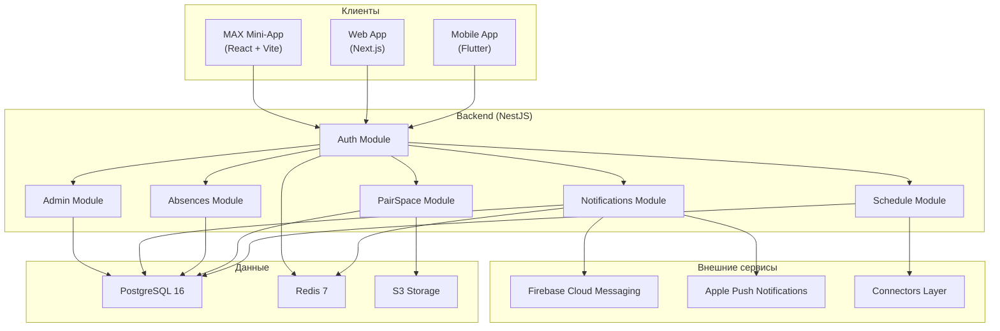
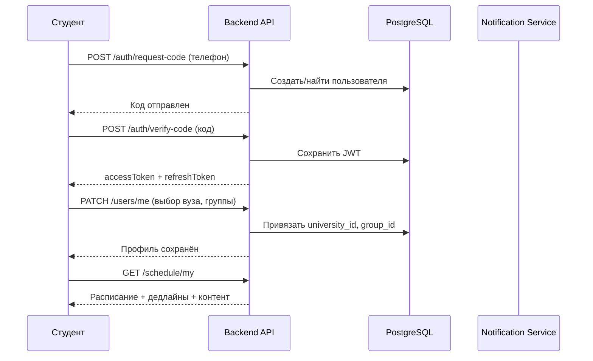
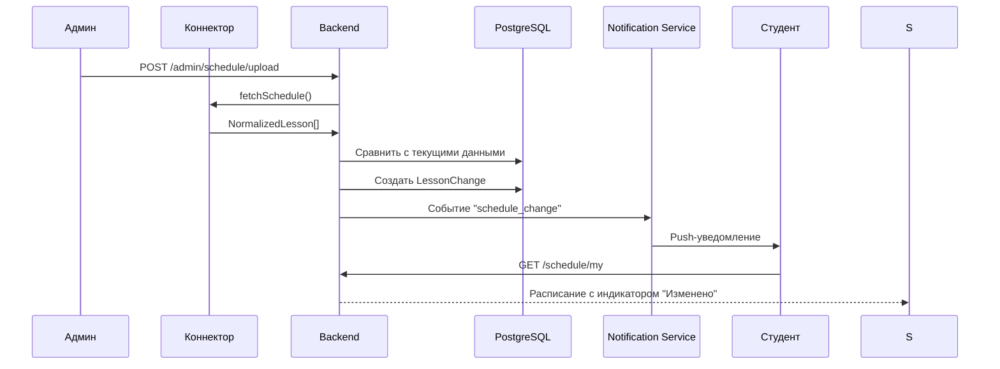

# Архитектура системы НаПаре

## Высокоуровневая схема

## Модульный монолит

Единый NestJS-процесс с модульной структурой. См. [ADR-0001](../03_DECISIONS/0001-modular-monolith.md).

Каждый модуль — автономная область ответственности:

| Модуль | Ответственность | Файлы |
|--------|----------------|-------|
| Auth | Регистрация, вход, JWT, роли | `modules/auth.md` |
| Schedule | Расписание, коннекторы, детект изменений | `modules/schedule.md` |
| PairSpace | Объявления, ДЗ, файлы, обсуждение | `modules/pair-space.md` |
| Absences | Статусы отсутствий, подтверждения куратора | `modules/absences.md` |
| Notifications | Push + in-app уведомления | `modules/notifications.md` |
| Admin | Управление вузом, ролями, расписанием | `modules/admin.md` |
| MyDay | Агрегация данных для главного экрана | `modules/my-day.md` |

## Потоки данных

### Регистрация студента

### Изменение расписания

## См. также

- [tech-stack.md](tech-stack.md) — стек технологий
- [data-model.md](data-model.md) — модель данных
- [roles-and-permissions.md](roles-and-permissions.md) — матрица прав
- [connectors.md](connectors.md) — слой коннекторов
- [03_DECISIONS/](../03_DECISIONS/) — архитектурные решения
