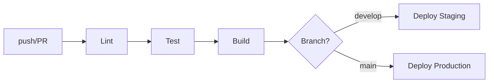

# CI/CD

## Pipeline



## GitHub Actions

```yaml
# .github/workflows/ci-cd.yml (упрощённо)
name: CI/CD
on:
  push:
    branches: [main, develop]
  pull_request:
    branches: [main, develop]

jobs:
  lint:
    runs-on: ubuntu-latest
    steps:
      - uses: actions/checkout@v4
      - run: pnpm install --frozen-lockfile
      - run: pnpm run lint

  test:
    needs: lint
    services:
      postgres: { image: postgres:16 }
      redis: { image: redis:7 }
    steps:
      - uses: actions/checkout@v4
      - run: pnpm run test:coverage

  build:
    needs: test
    steps:
      - uses: docker/build-push-action@v5

  deploy-staging:
    needs: build
    if: github.ref == 'refs/heads/develop'
    runs-on: ubuntu-latest
    environment: staging

  deploy-production:
    needs: build
    if: github.ref == 'refs/heads/main'
    runs-on: ubuntu-latest
    environment: production
```

## Стратегия веток

```
main (production)
  ↑ merge (≥1 approval)
develop (staging)
  ↑ merge (автоматически)
feature/xxx (от develop)
  ↑ rebase перед PR
```

## Правила веток

| Правило | main | develop |
|---------|------|---------|
| Require PR | ✅ | ✅ |
| Required reviews | ≥ 1 | ≥ 1 |
| CI must pass | ✅ | ✅ |
| Force push | ❌ | ❌ |

## Среды

| Среда | URL | Деплой |
|-------|-----|--------|
| Local | localhost | `docker compose up` |
| Staging | staging.napare.ru | Авто при push в develop |
| Production | napare.ru | Ручной при merge в main |

## См. также

- [ops/runbooks.md](runbooks.md) — runbook'и
- [ops/monitoring.md](monitoring.md) — мониторинг
